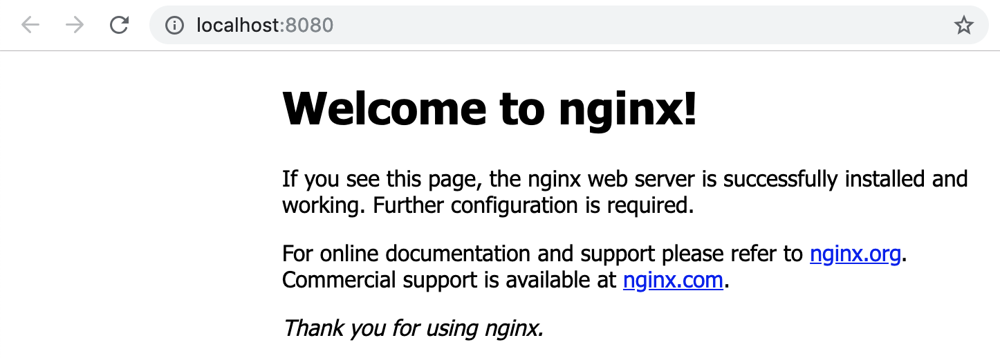

# Lab 04 - Pods

In this lab we will run our first, very basic, application on Kubernetes.  We will basically run a single pod as our application.

## Task 1: Creating a namespace

Create a namespace for this lab:

```
kubectl create ns lab-04
```

Verify that your namespace was created:

```
kubectl get namespaces

---

default           Active   25m
kube-node-lease   Active   25m
kube-public       Active   25m
kube-system       Active   25m
lab-04            Active   30s
```

## Task 2: Starting your first pod

To run your first pod (the official nginx container image), run the following
command:

```
kubectl run --restart=Never --image=nginx  nginx -n lab-04

---

pod/nginx created
```

The above command will create a single pod that is based on the official nginx container image.  Run the following command to verify that the pod has been created and is in the running state (if the pod is not yet in the running state wait a couple of seconds and try to run the command again):

```
kubectl get pods -n lab-04

---

NAME    READY   STATUS    RESTARTS   AGE
nginx   1/1     Running   0          30s
```

As we have not yet configured any services and/or ingresses we will use a litte "hack" to access our pod we just created.

Run the following command to forward the port of the pod (in our case port 80) running in our Kubernetes cluster to a port on your laptop (in this case port 8080).

```
kubectl -n lab-04 port-forward pods/nginx 8080:80
```

> NOTE: your prompt will be locked by the port-forward process

Now go to your browser and surf to http://localhost:8080, you should be greeted with the default nginx welcome page:



If that works you can close the port-foward connection by pressing `CTRL+c`.

## Task 3: Connecting to your pod

To connect to your pod, you can use the following command (notice how it resembles the `docker container exec` command in options and functionality):

```
kubectl -n lab-04 exec -it nginx -- bash

---

root@nginx:/#
```

Notice how the prompt changes.  `exec`-ing into a pod is very powerful for troubleshooting, but keep in mind that by default pods/containers are immutable so remember to not make any changes inside the pods/container.

To exit run the `exit` command.

```
exit
```

## Task 4: Pod logs

Again similar to when working with Docker containers, Kubernetes has a built-in feature that exposes all stdout/stderr output into logs.  To access those logs issue the following command:

```
kubectl -n lab-04 logs nginx

---

127.0.0.1 - - [11/Mar/2019:11:40:47 +0000] "GET / HTTP/1.1" 200 612 "-" "curl/7.52.1" "-"
127.0.0.1 - - [11/Mar/2019:11:40:48 +0000] "GET / HTTP/1.1" 200 612 "-" "curl/7.52.1" "-"
127.0.0.1 - - [11/Mar/2019:11:40:49 +0000] "GET / HTTP/1.1" 200 612 "-" "curl/7.52.1" "-"
127.0.0.1 - - [11/Mar/2019:11:40:50 +0000] "GET / HTTP/1.1" 200 612 "-" "curl/7.52.1" "-"
```

> NOTE: if your logs are empty, repeat Task 2 where you `kubectl port-forward`
> the container port and hit reload the page a couple more times in your
> browser

A very handy option of `kubectl logs` is that you can follow them using the `-f` option, this is extremely useful when troubleshooting:

```
kubectl -n lab-04 logs -f nginx
```

Hit `CTRL+c` to exit the logs.

## Task 5: Getting pod details

Like with most objects in Kubernetes you can use the `kubectl describe` command to get more information about a specific pod, for example:

```
kubectl -n lab-04 describe pods nginx

---

Name:             nginx
Namespace:        lab-04
Priority:         0
Service Account:  default
Node:             minikube/192.168.59.102
Start Time:       Mon, 11 Dec 2023 11:02:27 +0100
Labels:           run=nginx
Annotations:      <none>
Status:           Running
IP:               10.244.0.3
IPs:
  IP:  10.244.0.3
Containers:
  nginx:
    Container ID:   docker://a2ea2a4bddabf445f367483fdee934a58e6c68fe63b2f8535ed0cbd43c85eecb
    Image:          nginx
    Image ID:       docker-pullable://nginx@sha256:10d1f5b58f74683ad34eb29287e07dab1e90f10af243f151bb50aa5dbb4d62ee
    Port:           <none>
    Host Port:      <none>
    State:          Running
      Started:      Mon, 11 Dec 2023 11:02:39 +0100
    Ready:          True
    Restart Count:  0
    Environment:    <none>
    Mounts:
      /var/run/secrets/kubernetes.io/serviceaccount from kube-api-access-b8x9d (ro)
Conditions:
  Type              Status
  Initialized       True
  Ready             True
  ContainersReady   True
  PodScheduled      True
Volumes:
  kube-api-access-b8x9d:
    Type:                    Projected (a volume that contains injected data from multiple sources)
    TokenExpirationSeconds:  3607
    ConfigMapName:           kube-root-ca.crt
    ConfigMapOptional:       <nil>
    DownwardAPI:             true
QoS Class:                   BestEffort
Node-Selectors:              <none>
Tolerations:                 node.kubernetes.io/not-ready:NoExecute op=Exists for 300s
                             node.kubernetes.io/unreachable:NoExecute op=Exists for 300s
Events:
  Type    Reason     Age    From               Message
  ----    ------     ----   ----               -------
  Normal  Scheduled  5m47s  default-scheduler  Successfully assigned lab-04/nginx to minikube
  Normal  Pulling    5m46s  kubelet            Pulling image "nginx"
  Normal  Pulled     5m35s  kubelet            Successfully pulled image "nginx" in 11.015474006s (11.015487658s including waiting)
  Normal  Created    5m35s  kubelet            Created container nginx
  Normal  Started    5m35s  kubelet            Started container nginx
```

## Task 6: Cleaning up

Clean up the namespace for this lab:

```
kubectl delete ns lab-04

---

namespace "lab-04" deleted
```
