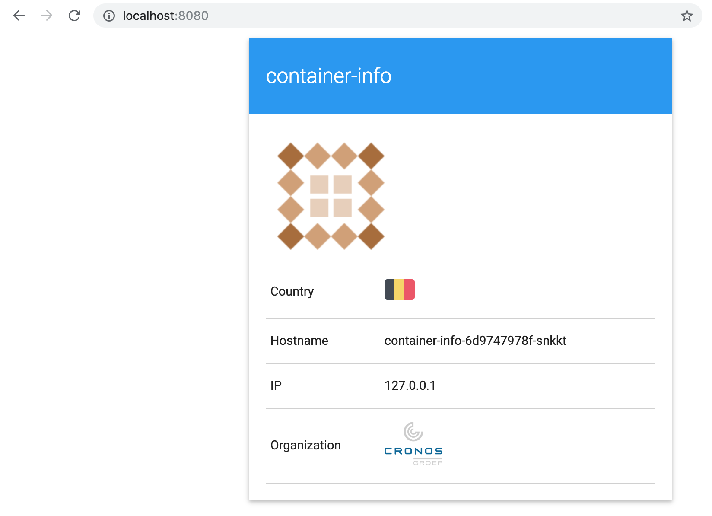

# Lab 06 - Deployments

Deploying pods is not something you normally do when working with Kubernetes, instead of interacting with pods directly you would use a higher lever construct.  Deployments are such a higher level construct, they are usually the way you would describe your applications.

## Task 0: Creating a namespace

Create a namespace for this lab:

```
kubectl create ns lab-06

---

namespace/lab-06 created
```

## Task 1: Creating a deployment

A very basic deployment looks like this:

```yaml
apiVersion: apps/v1
kind: Deployment
metadata:
  name: container-info
  labels:
    app: container-info
spec:
  replicas: 1
  selector:
    matchLabels:
      app: container-info
  template:
    metadata:
      labels:
        app: container-info
    spec:
      containers:
      - name: container-info
        image: gluobe/container-info:blue
        ports:
        - containerPort: 80
```

Copy the above into a file `lab-06-deployment.yml` and `kubectl apply` it:

```
kubectl apply -f lab-06-deployment.yml -n lab-06

---

deployment.apps/container-info created
```

Use `kubectl port-forward` to see the deployed application in your local browser (NOTE: as we are forwarding a deployment we are using `deployments/*` instead of `pods/*` like we used in a previous lab):

```
kubectl -n lab-06 port-forward deployments/container-info 8080:80

---

Forwarding from 127.0.0.1:8080 -> 80
Forwarding from [::1]:8080 -> 80
```

Check out the page: http://localhost:8080



Kill the `kubectl port-forward` process by pressing `CTRL+c`.

## Task 2: Scaling a deployment

Because we are using a deployment we can very easily scale our application from a Kubernetes point of view (you of course need to ensure that your application is stateless so it can properly scale).

Scaling your running application is as simple as:

```
kubectl -n lab-06 scale deployment container-info --replicas=3

---

deployment.apps/container-info scaled
```

When you do a `kubectl get pods -n lab-06` quickly enough you will see that there are 2 additional container-info pods being started (if you are not fast enough you will see them in the `Running` state already).

```
kubectl get pods -n lab-06

---

NAME                              READY   STATUS    RESTARTS   AGE
container-info-86bcc46f95-7rg7j   1/1     Running   0          1m
container-info-86bcc46f95-hwcnl   1/1     Running   0          3m
container-info-86bcc46f95-wtz7k   1/1     Running   0          1m
```

Scaling down to 1 can be done by re-applying the original YAML:

```
kubectl apply -f lab-06-deployment.yml -n lab-06
```

When you do a `kubectl get pods -n lab-06 ` you will see 2 pods are
being terminated:

```
kubectl get pods -n lab-06

---

NAME                              READY   STATUS        RESTARTS   AGE
container-info-6d9747978f-5n6z9   1/1     Running       0          3m
container-info-6d9747978f-ndl6n   0/1     Terminating   0          1m
container-info-6d9747978f-vmfdd   0/1     Terminating   0          1m
```

> NOTE: similarly, scaling up can also be done by editing the "replica" field in
> the YAML

## Task 3: Exposing the deployment via a service

When our deployment consists of multiple pods we can't use the port-forward to reach all pods. In this scenario we will have to create a service and expose this service.

In the next lab we will dig deeper in creating a service. For now just follow these commands.

```
kubectl -n lab-06 expose deployment container-info --type NodePort --name container-info

---

service/container-info exposed
```

Our service is exposed now. Let's go find the port where it is running on. We will be able to open the service in your default browser with the following command.

```
minikube service container-info -n lab-06

---

|-----------|----------------|-------------|-----------------------------|
| NAMESPACE |      NAME      | TARGET PORT |             URL             |
|-----------|----------------|-------------|-----------------------------|
| lab-06    | container-info |          80 | http://192.168.59.102:31748 |
|-----------|----------------|-------------|-----------------------------|
🎉  Opening service lab-06/container-info in default browser...
```

When following these steps you are able to reach all the pods from the service. As said before, we will dig deeper into creating these services in the next lab.

## Task 4: Changing the image of a deployment

Updating the image (tag) of a deployment is just as easy as scaling a deployment and it also can be done using the CLI or by editing the YAML.

```
kubectl -n lab-06 set image deployment container-info container-info=gluobe/container-info:green

---

deployment.apps/container-info image updated
```

Or simply edit the YAML and `kubectl apply` it again:

```yaml
apiVersion: apps/v1
kind: Deployment
metadata:
  name: container-info
  labels:
    app: container-info
spec:
  replicas: 1
  selector:
    matchLabels:
      app: container-info
  template:
    metadata:
      labels:
        app: container-info
    spec:
      containers:
      - name: container-info
        image: gluobe/container-info:green
        ports:
        - containerPort: 80
```

Open the application again, the box should be green now:

```
minikube service container-info -n lab-06
```

## Task 5: Cleaning up

Clean up the namespace for this lab:

```
kubectl delete ns lab-06

---

namespace "lab-06" deleted
```
